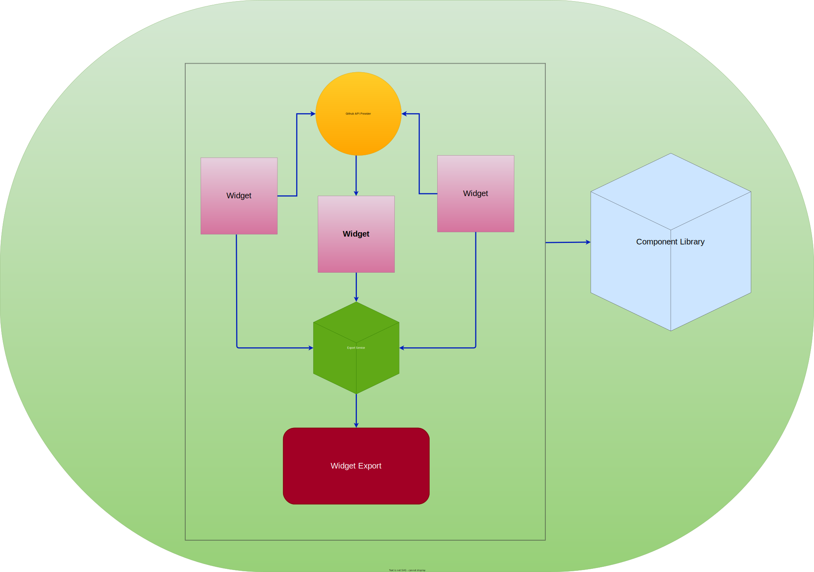

<h1>Your Github Widgets</h1>

**Your Github Widgets** was an idea I got by looking at [honeypot.io](https://www.honeypot.io)'s github contributions section (you need to sign in using github to see it) in the profiles page

The goal of this project is to enable developers with account in github to get their stats related information such as

1. Number of contributions 
2. number of commits 
3. number of stars across projects
   - You get the idea right 💡

, export them as widgets and integrate into any application

<h2>Table of Contents<h2>

- [Goal](#goal)
- [Use cases](#use-cases)
  - [Personal Blog](#personal-blog)
  - [Thirdy Party Apps](#thirdy-party-apps)
- [Bare Minimum](#bare-minimum)
- [Motivation](#motivation)
- [Foundation](#foundation)
  - [Where To Explore](#where-to-explore)
  - [Architecture](#architecture)
    - [Github API Provider](#github-api-provider)
    - [What is stored ?](#what-is-stored-)
    - [Widgets](#widgets)
      - [List of Widgets](#list-of-widgets)
    - [Export Service](#export-service)
    - [Widget Export](#widget-export)
    - [Component Library](#component-library)
    - [Federation](#federation)
  - [Code Organization](#code-organization)
  - [Tech Stack](#tech-stack)

## Goal
The main goal of this project is to make meaning full applications using Github Statistical information

In order for the stats to become useful, wouldn't it be cool if a web app is able to export them as html widgets either as plain html mark up with css or through the  language frameworks of your choice such as react/vue/angular, tailwind css etc as reusable components that can be plugged into any projects.

Sounds valid € , but not so sure where to use those widgets 🤔

## Use cases

### Personal Blog
- Imagine your building your own personal blog where you'd like to showcase your github stats.

- You wanna show only specific statistics such as contributions you've made or stars you have earned

### Thirdy Party Apps

- Imagine your building a profile based application , where in you'd like to showcase the users github statistics

- Expose an API that can let third party applications integrate into widget context and make use of the widgets

...A Lot more use cases can come up over time 💡💡

## Bare Minimum

To begin with a bare minimum set of features, it's ideally nice to have an application that implements [Use case 1](#personal-blog) 

Exporting the statistics as html widgets could be a first step for a bare minimum app

## Motivation
There are quite few motivational aspects behind the idea for this project.
1. Try out a new tech stack
2. Learn new framework
3. Experiment with some architectures

## Foundation
Principle foundation for this project is Github. So in order to make this project to work , applications need to talk to github APIs to provide useful statistics as widgets

So Github APIs have to be explored well to figure out the foundational architecture for the project

### Where To Explore
1. Rest API can be explored [here](https://docs.github.com/en/rest?apiVersion=2022-11-28)

### Architecture
 

 #### Github API Provider
 Github API provider provides auth related information to the consumers of the API (Widgets).

 Useful information is stored in a persisted storage to be able to remember the authenticated user

 #### What is stored ?
 - Auth token for exchange of information
 - Github User data 

#### Widgets

Widgets are consumers of github apis and providers to widget export package.

Widgets are limited to API specific logic such as connecting to a github API , defining the external libraries to be used in the package
A single Widget cannot call more than one Github API
For instance , `Contribution` widgets can only make request github contributions API

A single `Widget`  define its own tech stack . 

> Contribution Widget can be a React app with graph ql connectors
> 
> Calendar widget can be a Vue app with trpc connector

##### List of Widgets
- Contribution
- Stars
- Calendar

#### Export Service
Export service provides an API gateway for `widgets` and `widget- export` to communicate.
Widget export recieves useful export related information from widget.

Code level transformations is done in export service.

> 💡 High level description of export service is TBD

#### Widget Export

Widget Export is responsible for exporting a widget as usable code snippet , that can be embedded in a static html page.

For instance , a contribution widget can be exported as html markup with  `tailwind` css or vanilla css 

Widget export is a sandbox environment that allows the following
1. Code level customizations
   1. Edit HTML/CSS and move elements around 
   2. Live preview of changes
2. Tailwind css integration
3. Vanilla css integration

> 💡 TBD: Define what external tool should be used 

#### Component Library
The Component library is the central repository of all the UI components that is shared between services

The library exposes two variants of components
1. React Components for React based widgets
2. Vue Components for Vue based widgets

#### Federation

> 💡 TBD: Define the federation logic here 
### Code Organization
- TBD
### Tech Stack
- TBD

